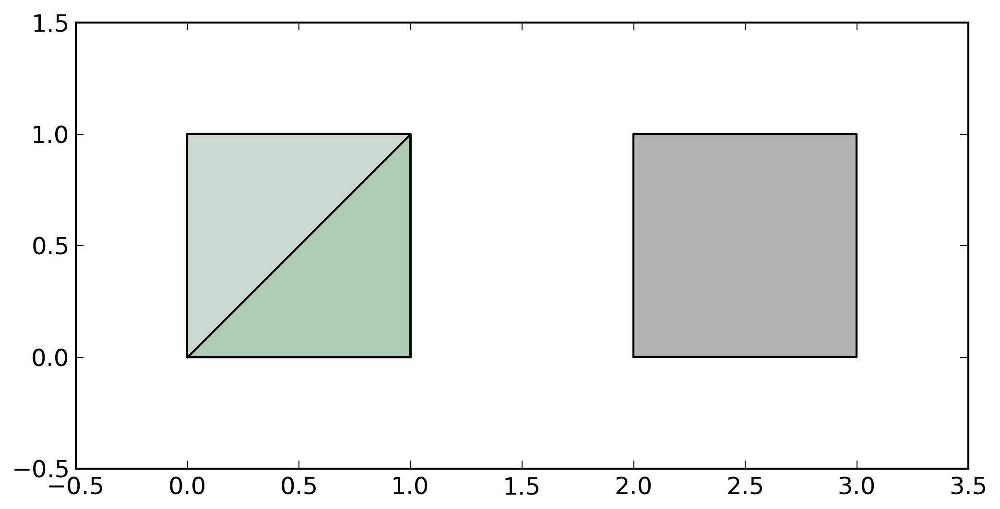
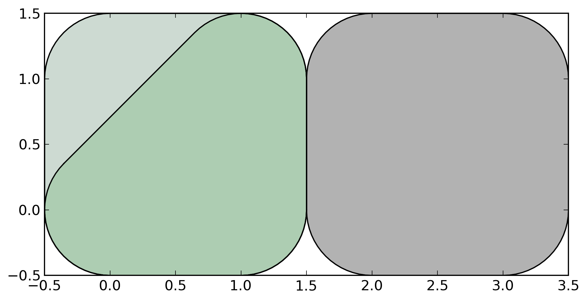

Introduction
------------

GeoPandas is a project to add support for geographic to [pandas](http://pandas.pydata.org) objects.  It currently implements a `GeoSeries` type which is a subclass of `pandas.Series`.
GeoPandas objects can act on [shapely](http://toblerity.github.io/shapely) geometry objects and perform geometric operations.

Examples
--------

    >>> p1 = Polygon([(0, 0), (1, 0), (1, 1)])
    >>> p2 = Polygon([(0, 0), (1, 0), (1, 1), (0, 1)])
    >>> p3 = Polygon([(2, 0), (3, 0), (3, 1), (2, 1)])
    >>> g = GeoSeries([p1, p2, p3])
    >>> g
    0    POLYGON ((0.0000000000000000 0.000000000000000...
    1    POLYGON ((0.0000000000000000 0.000000000000000...
    2    POLYGON ((2.0000000000000000 0.000000000000000...
    dtype: object

Some geographic operations return normal pandas object.  Calling the `area()` method of a `GeoSeries` will generate a `pandas.Series` containing the area of each item in the `GeoSeries`:

    >>> print g.area
    0    0.5
    1    1.0
    2    1.0
    dtype: float64

Other operations return GeoPandas objects:

    >>> g.buffer(0.5)
    Out[15]:
    0    POLYGON ((-0.3535533905932737 0.35355339059327...
    1    POLYGON ((-0.5000000000000000 0.00000000000000...
    2    POLYGON ((1.5000000000000000 0.000000000000000...
    dtype: object

GeoPandas objects also know how to plot themselves.  GeoPandas uses [descartes](https://pypi.python.org/pypi/descartes) to generate a [matplotlib](http://matplotlib.org) plot. To generate a plot of our GeoSeries, use:

    >>> g.plot()

GeoPandas also implements an alternate constructor that can read any data format recognized by [fiona](http://toblerity.github.io/fiona).  To read a [file containing the boroghs of New York City](http://www.nyc.gov/html/dcp/download/bytes/nybb_13a.zip):

    >>> boros = GeoSeries.from_file('nybb.shp')
    >>> boros.area.astype(int)
    0    1623855479
    1    3049948268
    2    1959433450
    3     636441882
    4    1186805996
    dtype: int64

 
TODO
----

- Not all Shapely operations are yet exposed to a GeoSeries
- Implement a GeoDataFrame and GeoPanel
- spatial joins and more...
